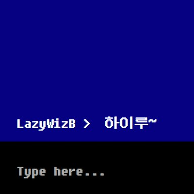
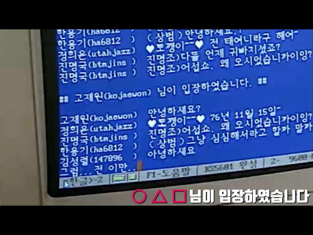

# 메신저 프로젝트
### UI설계
### **- 필요 화면 정하기**
**1. 로그인** 
   - 아이디, 비밀번호 입력창
   - 로그인, 회원가입 버튼  

**2. 회원가입**
   - 아이디
   - 아이디 중복검사
   - 비밀번호
   - 비밀번호 확인 검사
   - 닉네임 설정
   - 이름
   - 이메일
   - 전화번호
   - 동의 항목
     - 서비스 이용약관
     - 개인정보 처리방침
     - 마케팅 정보수신 동의(선택사항)  

**3. 대화목록**  

**4. 친구목록**  

**5. 친구추가**  
   - 아이디 검색
   - 친구목록 추가  

**6. 채팅화면**
   - 채팅메세지 입력창
   - 대화 창
   - 읽음 여부 확인
   - 파일 이미지 첨부
   - 이모티콘/스티커  

**7. 알림**
   - UI적으로 배지(아이콘 위 숫자 표시)나 알림 팝업
   - 푸시알림  

### **- 컨셉 정하기**
  - '개발자 교육과정'이라는 이미지의 확장으로 옛 도스 컴퓨터의 콘솔창을 모티브로 디자인
  - 옛 PC통신 시절 채팅을 떠올리는 레트로한 느낌
  - 파란배경에 비트맵 폰트
    1. Fixedsys: 도스 환경에서 기본적으로 사용되던 고정폭 글꼴로, 영어와 한글이 섞인 화면에서도 잘 표시.
    2. 굴림체(DOS 버전): 도스 환경에서 사용되던 한글 비트맵 폰트 중 하나로, BBS 시스템에서도 많이 사용
  - 이미지 예시  
  
  